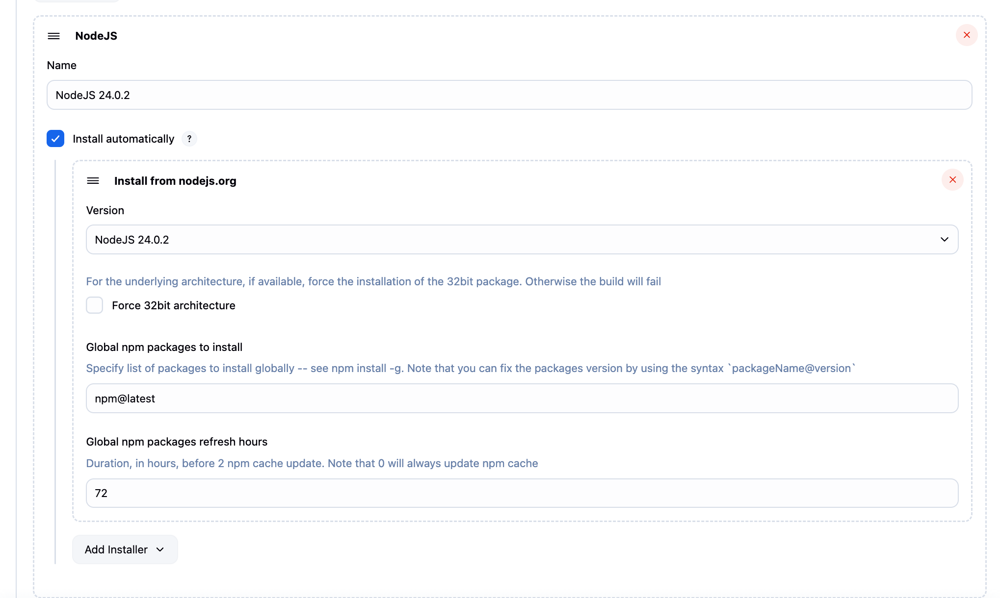
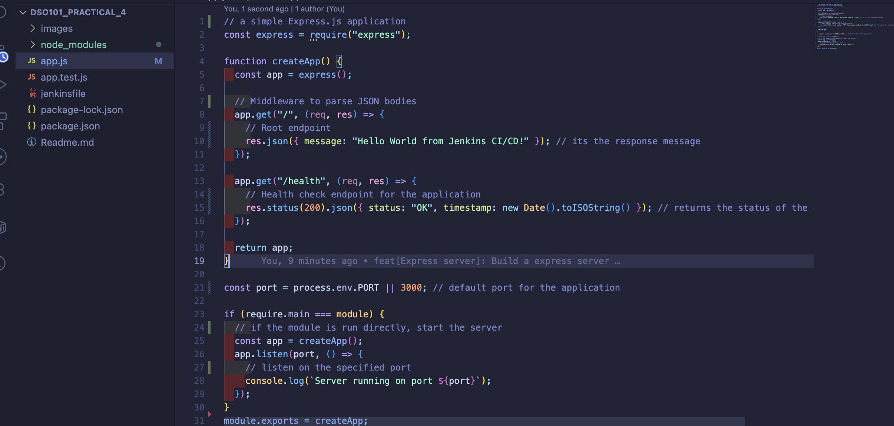
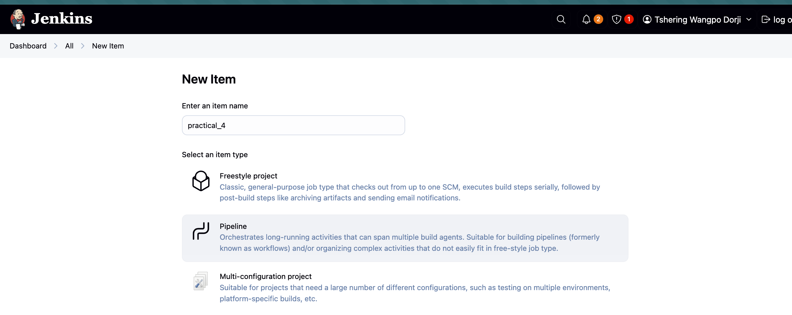
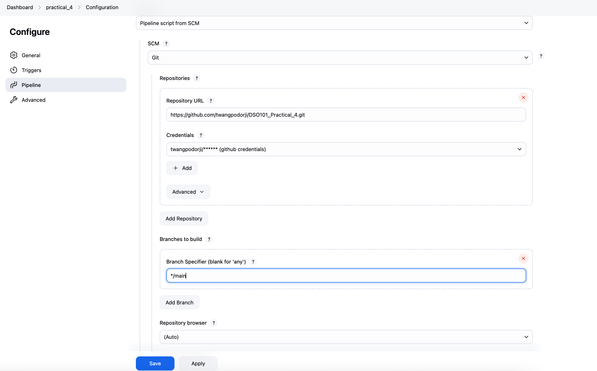
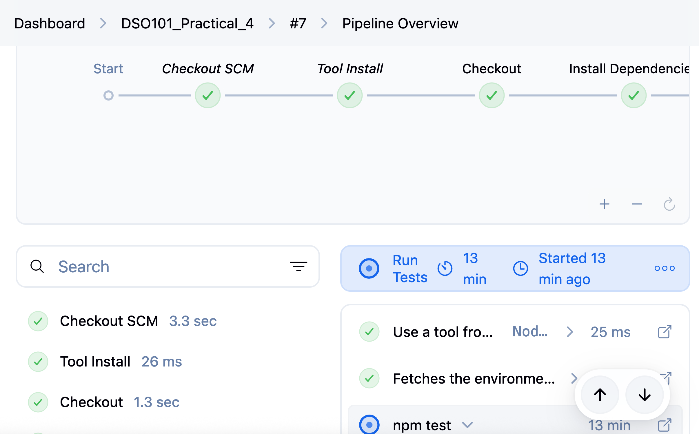
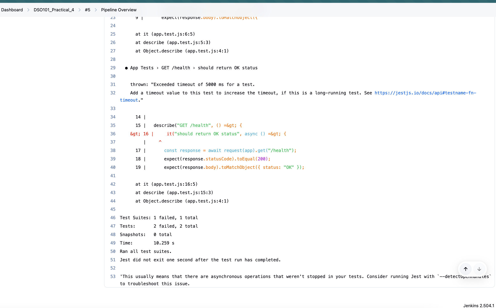
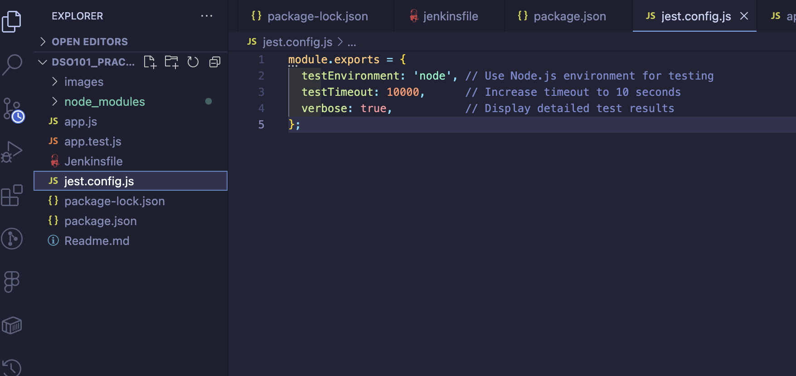

# Practical 4: Jenkins CI/CD for Node.js

### Objective:

The main goal of this project was to establish a full Continuous Integration and Continuous Deployment (CI/CD) pipeline using Jenkins for a Node.js application. The objectives of this hands-on exercise were:

- Configure and deploy a Jenkins server with appropriate settings.
- Develop a Node.js application with integrated automated testing.
- Build a Jenkins pipeline to automatically handle building, testing, and deploying code updates.

### Practical Steps:

1.Installation of required plugins

- Installed necessary Jenkins plugins such as NodeJS, Git, and Pipeline to support the CI/CD process.
- Configured the NodeJS plugin to use the correct version of Node.js for the application.
- Set up the Git plugin to connect to the Git repository where the Node.js application code is stored.

2.Node.js configuration

- Installed and configured Node.js in Jenkins Global Tool Configuration
- Designated NodeJS version 24.0.2 as the default for the pipeline

3.Node.js application setup

4.Jenkins Pipeline Configuration

SCM Configuration with Git    

5.Output and Results
- Developed a multi-stage Jenkins pipeline using a Jenkinsfile
- Code Checkout: Retrieved source code from the Git repository
- Dependency Installation: Installed npm packages
- Automated Testing: Executed tests with coverage reporting
- Application Build: Performed the build process for the application
- Artifact Archiving: Saved build outputs for future reference
- Deployment Simulation: Simulated deployment to a staging environment

6.Pipeline Execution
- Executed the Jenkins pipeline, which automatically triggered on code changes

### Challenges and Solutions

There was a asynchronous operations still running after the tests have been completed.

Implemented a jest timeout to ensure all asynchronous operations complete before the tests finish.

