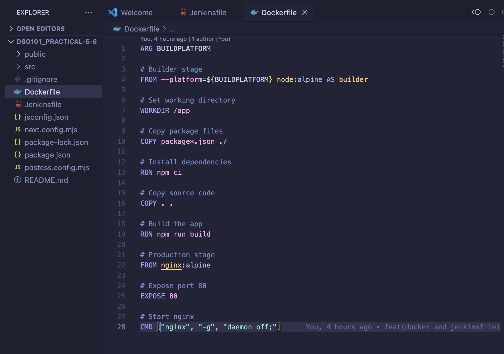

# Practicals 5 and 6: Declarative Pipeline for Jenkins and Docker Integration

## Objective

The objective of this project is to implement a complete CI/CD pipeline using **Jenkins Declarative Pipeline** for a React application. The pipeline includes:

- Automated testing
- Building
- Docker containerization
- Deployment

[link for Practical 5-6](https://github.com/twangpodorji/DSO101_Practical-5-6.git)

This demonstrates modern DevOps practices.

---

## Step-by-Step Implementation

### Phase 1: React Application Setup

1. **Create React Application**

2. **Modify `package.json` scripts** for CI/CD compatibility  

---

### Phase 2: Jenkins Configuration

1. **Install Required Plugins**  
   All required plugins were already installed from a previous assignment.

2. **Configure Global Tools**  
   - Set up Node.js `24.0.2` in Global Tool Configuration.  
   - Named installation: `"NodeJS 24.0.2"`  

3. **Create Pipeline Job**  
   - Navigate to `New Item → Pipeline`  
   
  

   - Configure SCM with the Git repository URL  
   - Set Script Path to `Jenkinsfile`  

---

### Phase 3: Jenkinsfile Creation

1. **Basic Pipeline Structure**  
   

2. **Pipeline Stages Implemented**
   - **Checkout**: Retrieve code and branch info
   - **Install Dependencies**: `npm ci` with error handling
   - **Test**: Automated testing with `junit` reporting
   - **Build**: React production build
   - **Docker Build**: Multi-stage Docker image
   - **Push to Docker Hub**: Secure image publishing
   - **Clean Docker Images**: Resource cleanup
   - **Deploy**: Environment-specific deployment

3. **Run Pipeline in Jenkins**  

### Phase 4: Docker Integration (Part 2: Challenge)

1. **Create Dockerfile**  

2. **Configure Docker Hub Credentials**
   - Added credentials to Jenkins credential store
   - Referenced securely in the pipeline  

3. **Test Build Locally**  

4. **Run Pipeline in Jenkins**

   - Image successfully uploaded to Docker Hub  

5. Results

---

