# Docker Compose Overview

## Introduction

This document provides a detailed summary of the Docker Compose Quickstart tutorial. It covers the essential concepts of Docker Compose through the creation of a simple Python web application. The application, built with the Flask framework, includes a hit counter using Redis, showcasing practical applications of Docker Compose in web development.

---

## Step-by-Step Instructions

### Step 1: Initial Setup

- **Create Project Directory**: A directory named `composetest` is established.
- **Write Application Code**: A Python file named `app.py` is created.

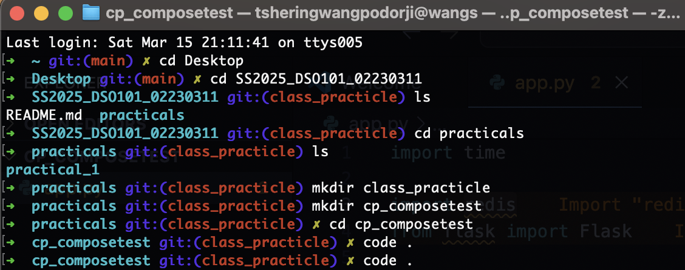

- **List Dependencies**: A `requirements.txt` file is created to list the necessary Python packages.
- **Create Dockerfile**: A `Dockerfile` is written to set up the Python environment, install dependencies, and run the Flask application.

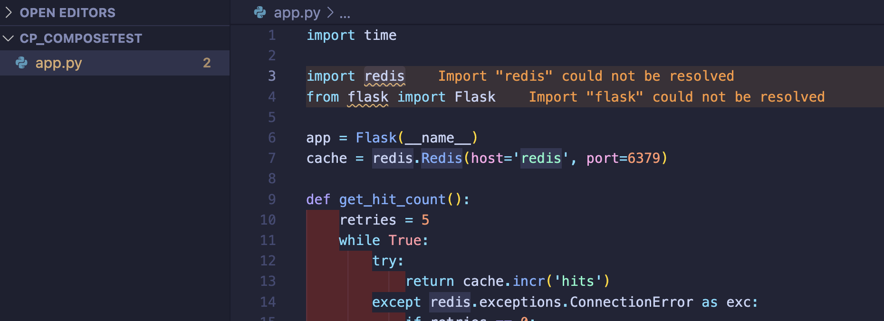

---

### Step 2: Define Services in a Compose File

- **Create Compose File**: A `compose.yaml` file is created to define two services: `web` (Flask application) and `redis` (Redis database).

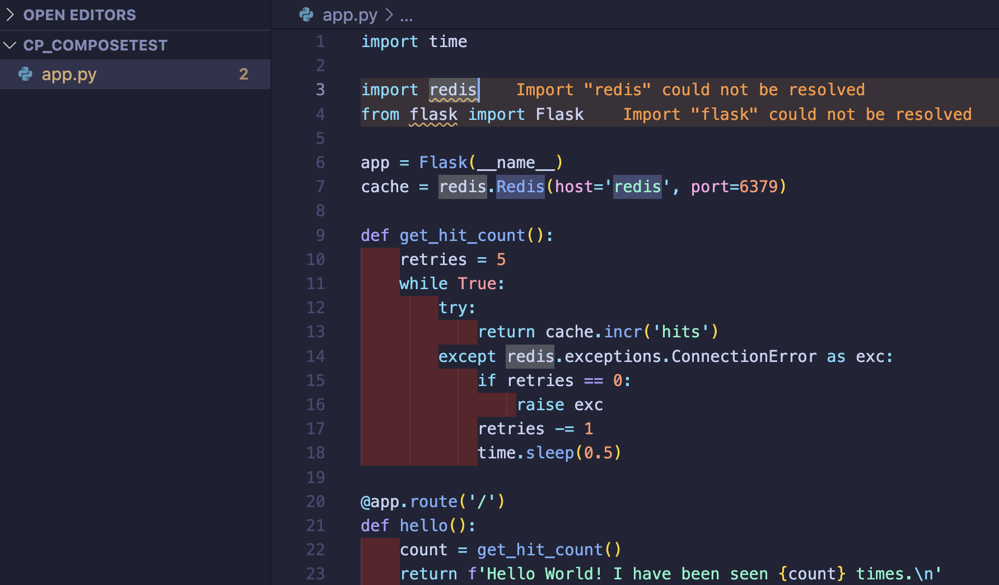

- **Configure Services**: The `web` service builds from the local Dockerfile and maps port 8000 on the host to port 5000 on the container. The `redis` service uses an Alpine-based Redis image.

---

### Step 3: Build and Run the Application with Compose

- **Launch Application**: The command `docker compose up` is used to build and start the defined services.

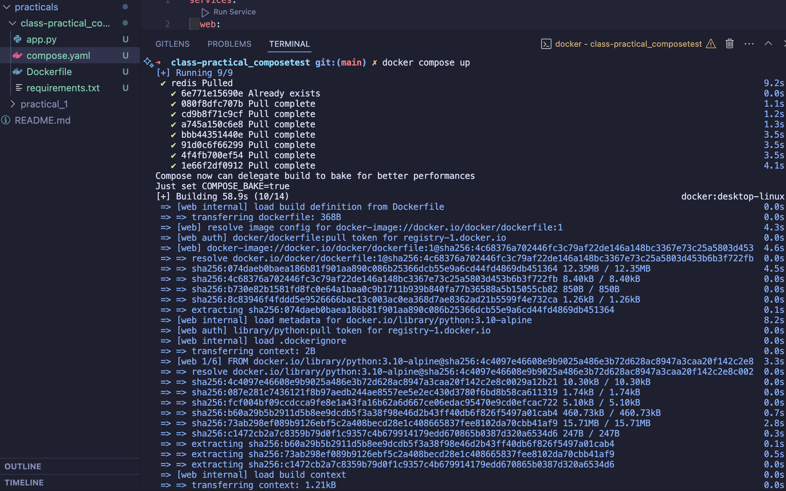

- **Verify Application**: Accessing `http://localhost:8000` in a web browser displays the application, with a hit counter that increments on each refresh.

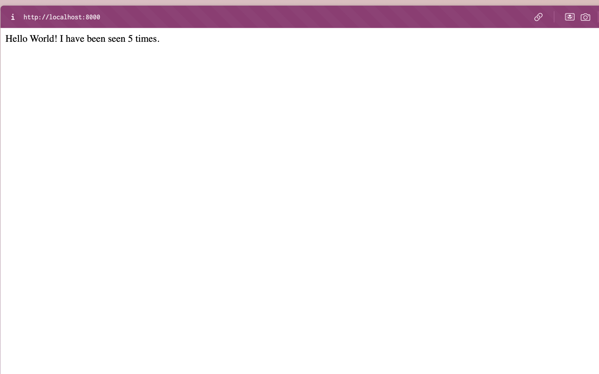
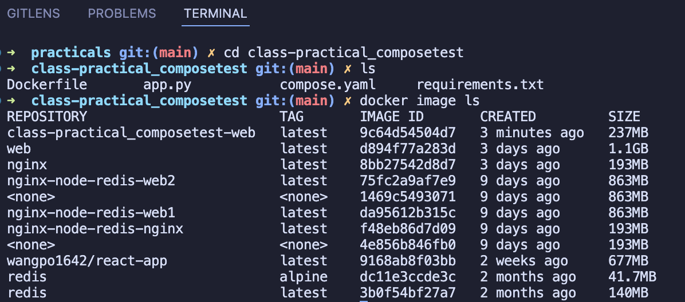
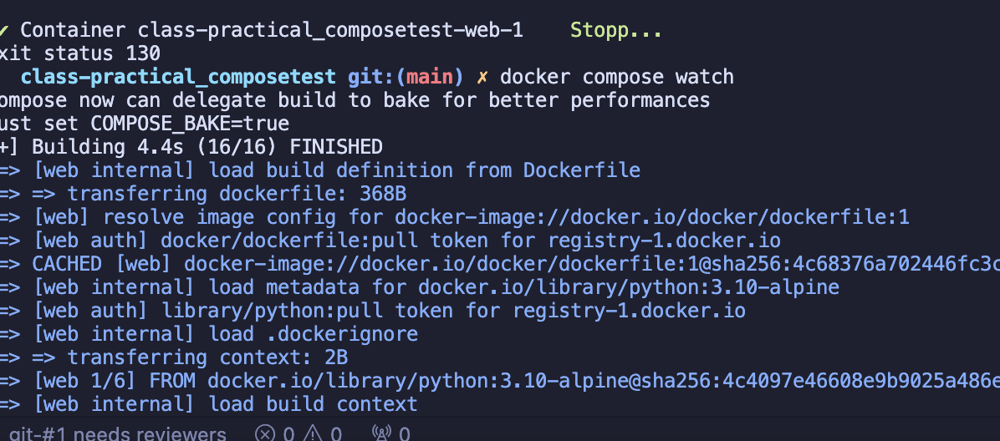
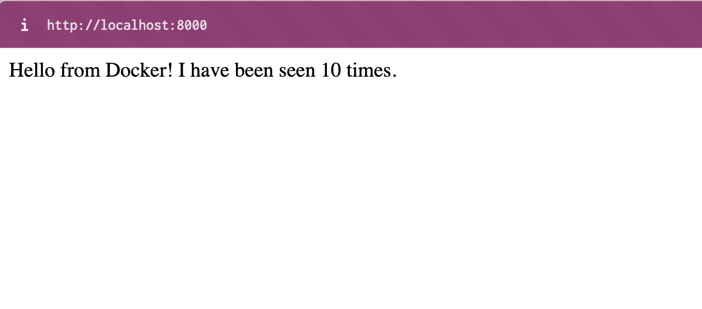

---

### Step 4: Modify the Compose File to Use Compose Watch

- **Integrate Compose Watch**: The `compose.yaml` file is modified to include `develop` and `watch` configurations, enabling automatic updates to the application upon code changes without restarting the container.

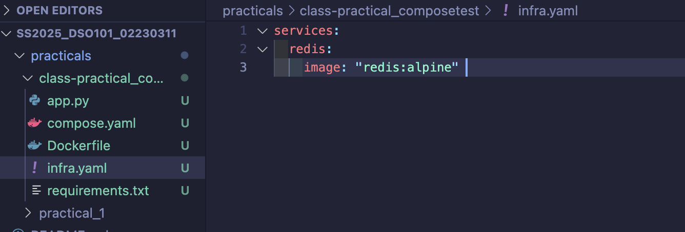

---

### Step 5: Rebuild and Run the Application with Compose

- **Activate Watch Mode**: Running `docker compose watch` starts the application in watch mode, allowing real-time updates.

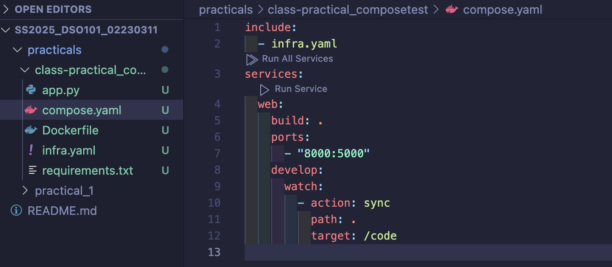

---

### Step 6: Update the Application

- **Modify Code**: Changing the greeting message in `app.py` and refreshing the browser demonstrates Compose Watch's functionality, as the updated message is displayed without manual restart.

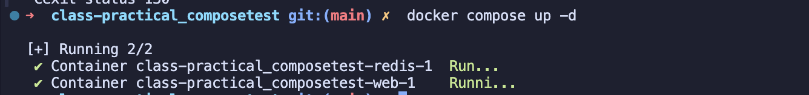

---

### Step 7: Separate Your Services

- **Modularize Services**: The Redis service is moved to a separate `infra.yaml` file, and the `compose.yaml` file is updated to include this new configuration, demonstrating how to modularize services for larger applications.

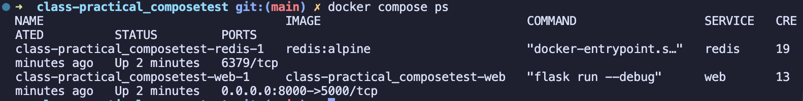

---

### Step 8: Explore Additional Commands

- **Run in Detached Mode**: Running services in the background using `docker compose up -d` and checking their status with `docker compose ps`.

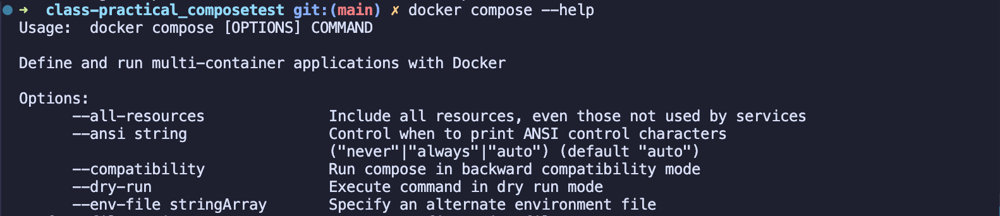

- **Manage Services**: Commands like `docker compose stop` and `docker compose down` are used to stop and remove services, respectively.

---

## Conclusion

This tutorial illustrates the power and flexibility of Docker Compose in managing multi-container applications. By following these steps, you can effectively develop, test, and deploy applications using Docker Compose.