# Practical Report: Docker Containerization

## Introduction

In developing process applications and their dependencies can be packaged into containers using the Docker containerisation platform. This guarantees that programs function flawlessly in development, testing, and production settings. Docker uses container-based virtualisation to streamline the deployment and execution of applications.

## Containerization

Containerization creates separate, self-contained packages (containers) that hold applications and everything they need to run. Unlike traditional virtual machines that simulate entire computers, containers share the core of the host operating system while staying completely isolated from each other.

This approach is much more efficient - containers start faster, use fewer resources, and allow more applications to run on the same hardware. They're lightweight yet provide strong separation through special operating system features that prevent containers from interfering with each other.

Think of containers as apartments in a building rather than separate houses - they share fundamental infrastructure but maintain privacy and independence.

## Steps Followed for Docker Containerization Exercise

### 1. Clone the Repository

Clone the repository from the following URL:

```sh
git clone https://github.com/twangpodorji/SS2025_DSO101_02230311.git
```

### 2. Check Out the Development Branch

Navigate into the cloned repository and switch to the development branch:

```sh
cd reactjs-subdevice-development
git checkout development
```

### 3. Install Application Libraries

Install the necessary dependencies using npm:

```sh
npm install
```

### 4. Run the Application Locally

Start the application to verify that it works as expected:

```sh
npm start
```

Issues realted to node version can be resolved by using nvm. Install nvm using the following command using the node versio
less than 16.
```sh
nvm use 16
```
`
### 5. Create a Dockerfile for Testing

Create a Dockerfile.test in the root working directory.

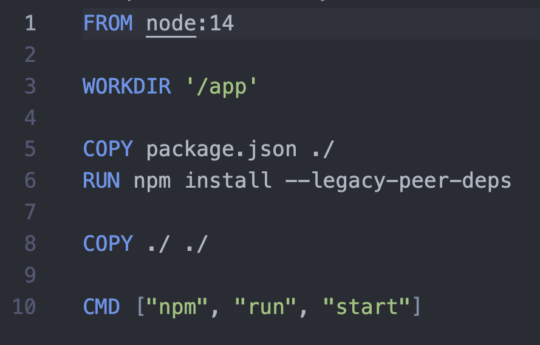 

### 6. Build the Docker Image

Build the Docker image using the following command:

```sh
docker build -f Dockerfile.test -t <User_ID>/<Image_name> .
```


### 7. Run the Docker Container

Run the Docker container with port forwarding and volume mounting:
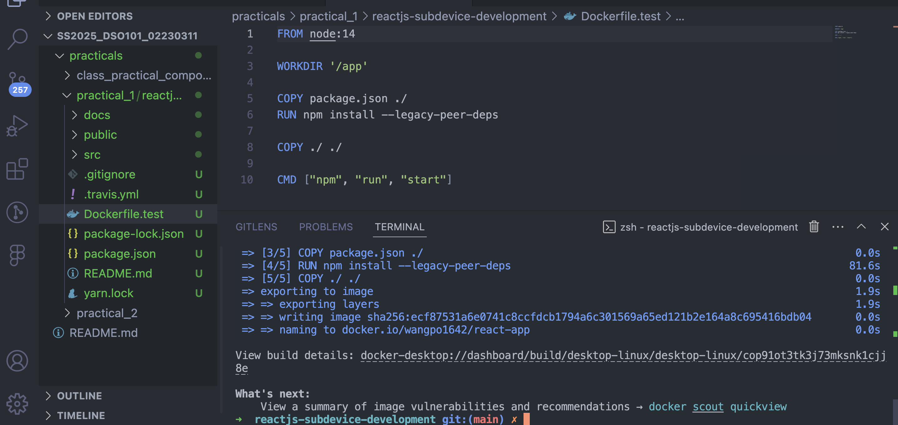

```sh 
docker run -d -p 3000:3000 -v /app/node_modules -v $(pwd):/app <user_name>/<image_name>
```
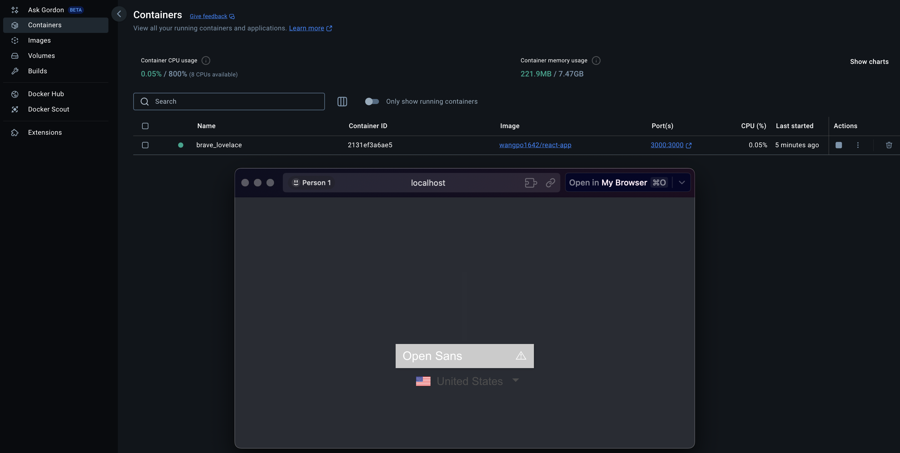


Check running containers:

```sh
docker ps
```
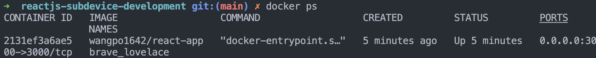


To stop the container:

```sh
docker stop <container_id>
```
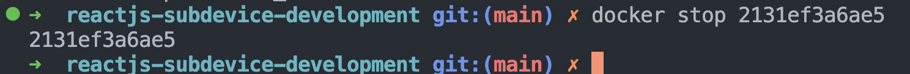

### 8. Create a Docker Compose File

Create a docker-compose.yml file.


### 9. Start the Docker Container Using Docker Compose

Start the container using Docker Compose:

```sh
docker compose up -d --build
```


### 10. Run Tests in a Separate Container

Check running containers:

```sh
docker ps
```

Access the running container:
```sh
docker exec -it <web_container_id> sh
```
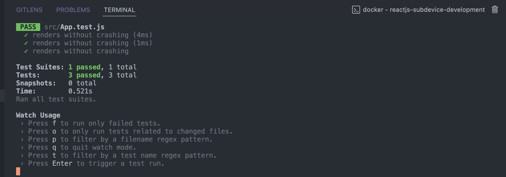

Run the tests inside the container:
```sh
npm run test
```


Exit the container shell:
```sh
exit
```
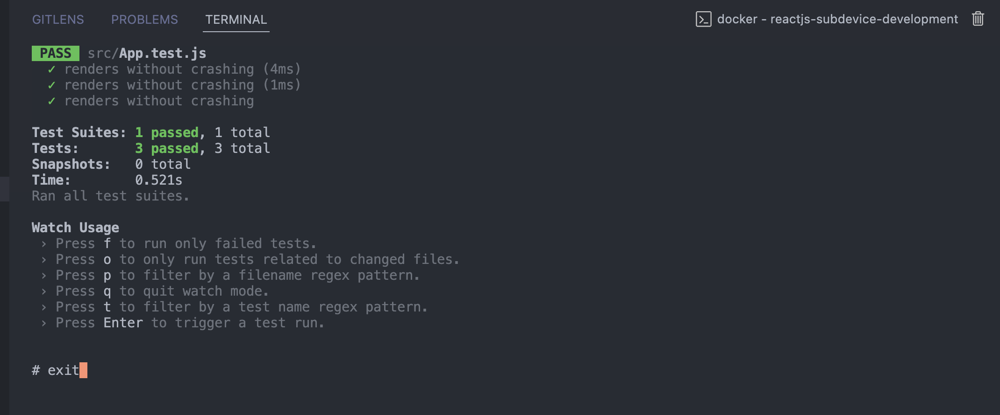


### 11. Add Test Service in Docker Compose

Modify the docker-compose.yml file to include a test service, then save the file.

### 12. Stop the Container

```sh
docker compose stop
```
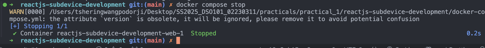

### 13. Create a Multi-Stage Build Dockerfile

Create a new Dockerfile implementing a multi-stage build process using different base images.
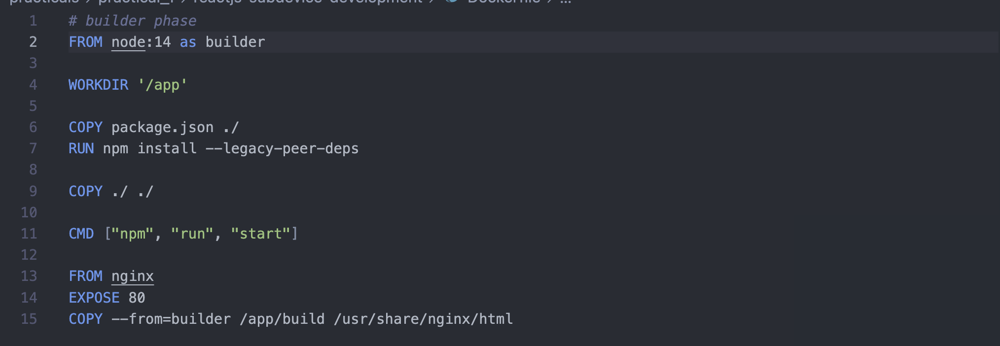


### 14. Rebuild and Start the Docker Container with the Test Service

Rebuild and start the container:

```sh
docker compose up -d --build
```
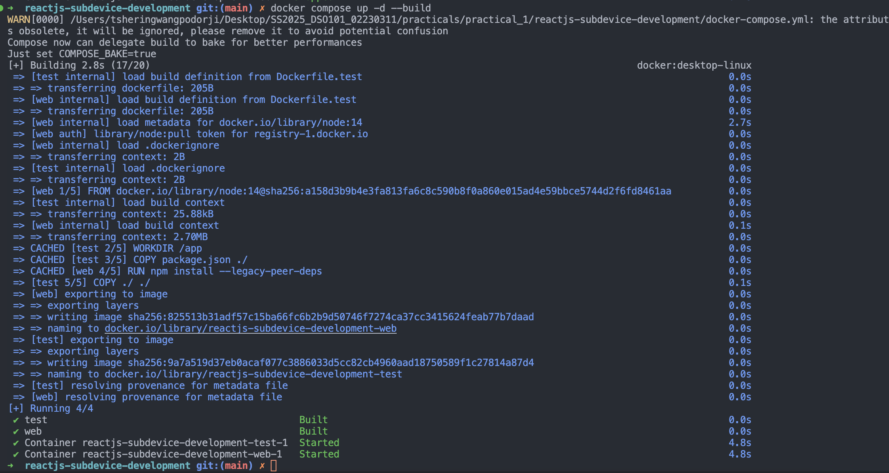
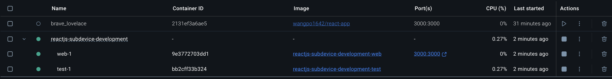

Check if the container is running:

```sh
docker ps
```
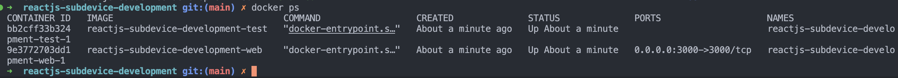


Once both services are running, stop the containers:

```sh
docker compose stop
```
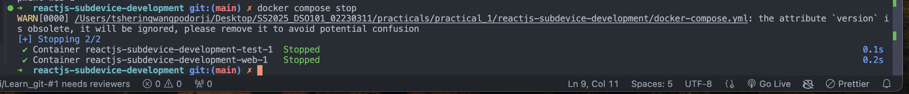

### 15. Build the Multi-Phase Container Setup

Run the multi-phase container build process:

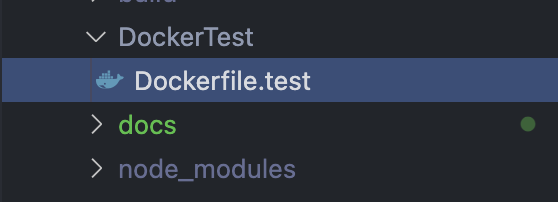

```sh
docker build .
```
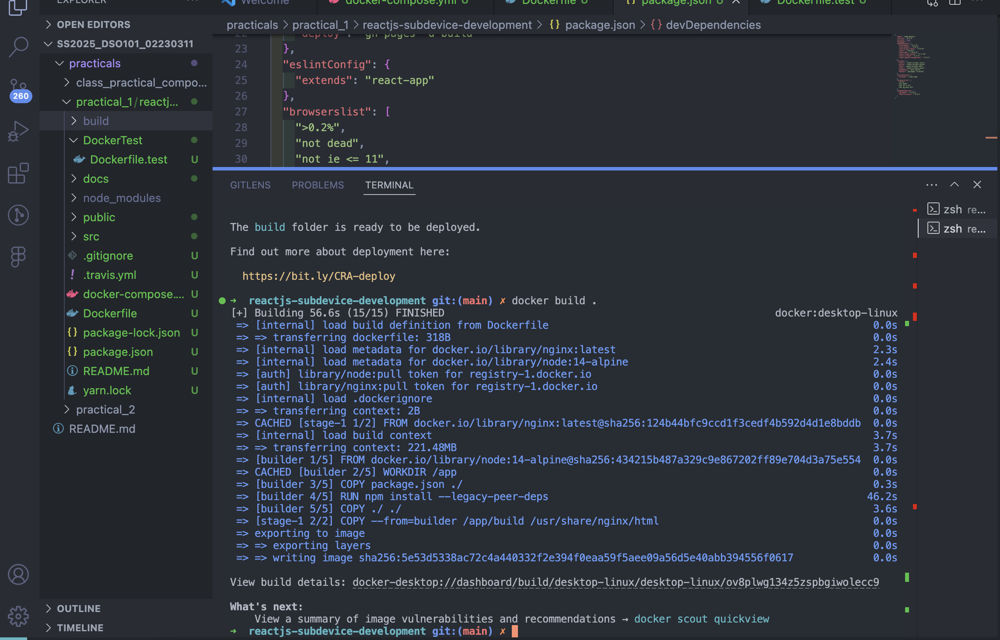


Ensure the image is successfully created by checking:

```sh
docker images
```


### 16. Start the Multi-Phase Container and Expose Ports

Run the container with exposed ports:

```sh
docker run -d -p 80:80 <image_ID>
```


Here, 8082 is the local host port and 80 is the container port.

### 17. Verify Running Container

Access the application in the browser:
```sh
http://localhost:80
```

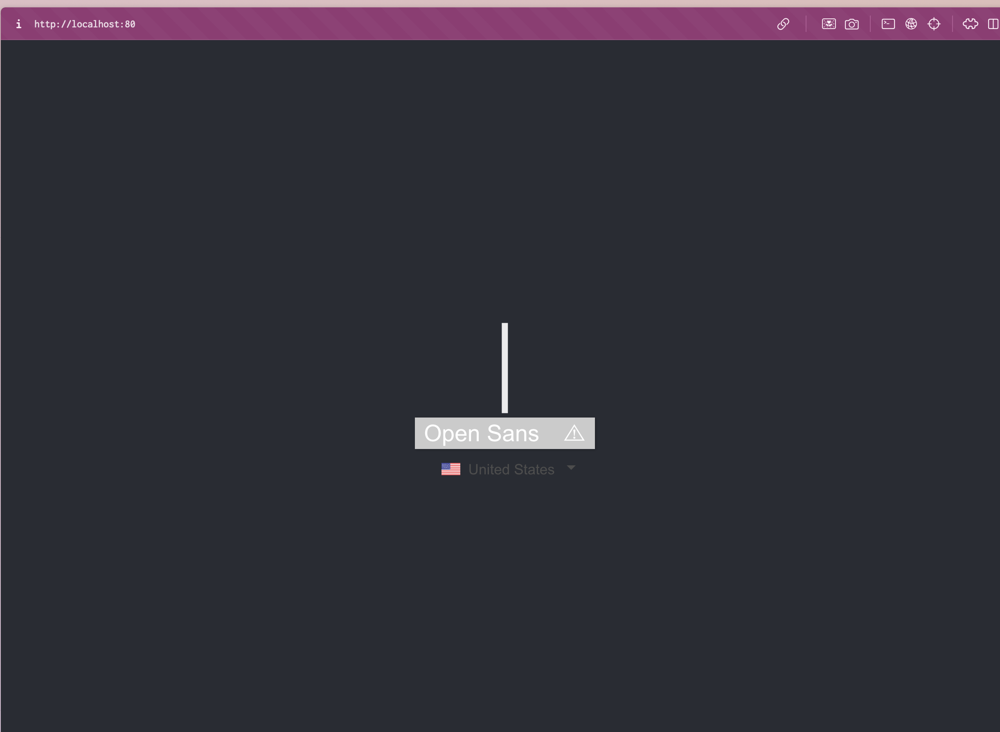