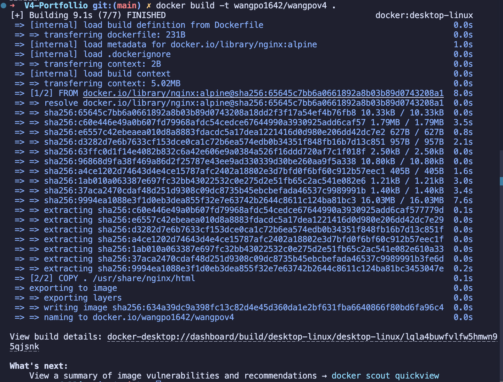

# Docker Practical 3: Docker Deployment using Docker Hub and Render.com

## Part 1: Creating and pushing a pre-built Docker image

### Step 1: Prepare the Application

In this practical, I will be using a simple portfolio website as the application to be containerized. The website is a static HTML/CSS and javascript on github. The website is hosted on Netlify, and the link to the website is provided below:

Link of website:

[Link of my personal website](https://wangpov4.netlify.app/)

The link of the GitHub repository that contains the website files and the implementation link is provided below:

[https://github.com/twangpodorji/V4-Portfollio.git](https://github.com/twangpodorji/V4-Portfollio.git)

### Step 2: After choosing the website, **CREATE A DOCKERFILE** to containerize the application like in the example below:

```Dockerfile
# Using the nginx alpine for image base
FROM nginx:alpine

# Copy the portfolio files to the nginx html directory
COPY . /usr/share/nginx/html

# Expose port 80 for the container
EXPOSE 80
```

### Step 3: Now Build the Docker Image, like in the given example below:

```
docker build -t wangpo1642/wangpov4 .
```



### Step 4: Test the Docker Image Locally

```
docker run -d -p 8001:80 wangpo1642/wangpov4
```


### Step 5: Push Image to Docker Hub

```Docker file
# Login to Docker Hub account
docker login

# Now upload (push) the docker image to Docker registry
docker push wangpo1642/wangpov4
```


## Part 2: Now Will Deploy the Docker Image to Render.com and view the website using the port localhost:8001. For that we need to create a Dockerfile and push the image to GitHub.

### Step 1: GitHub Setup

- The same application was committed and pushed to a public GitHub repository.
- The Dockerfile was placed in the root directory.

### Step 2: Deploy to Render

- Created a new web service on Render.com (a cloud platform for deploying applications).

- Selected Docker as deployment method.

- Connect to GitHub repository containing the Dockerfile

- Set the Dockerfile path as Dockerfile

- Render automatically built and deployed the container as shown in the given example below:
  

      Successful deployment to Render. We can now view the image locally using the port ```localhost:8001```
      

## Conclusion

In this hands on Docker exercise, I learned how to containerize a website and deploy it through multiple methods. The process involved:

1. Creating a Dockerfile for a portfolio website
2. Building a Docker image from that file
3. Testing the container locally to verify it worked properly
4. Publishing the image to Docker Hub for others to access

Additionally, I explored automated deployment by:

Connecting a GitHub repository (containing my Dockerfile) to Render.com
Setting up automatic deployment when changes are pushed to GitHub

This practical experience taught me the complete workflow of containerizing an application from local development to public deployment using Docker's ecosystem and third party hosting platforms.

